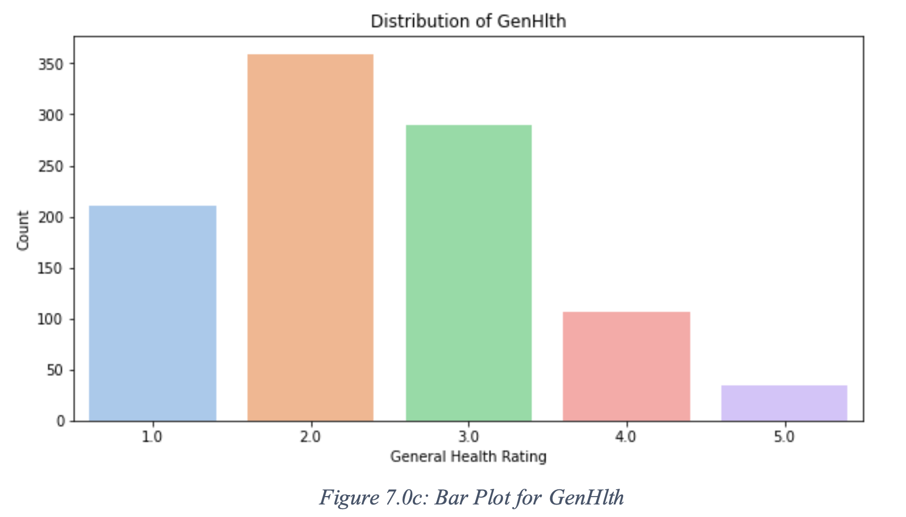

# Diabetes Statistical Analysis

## Project Overview
This project explores the relationships between various health factors and the prevalence of diabetes in a dataset with over 70,000 observations. Key health variables such as BMI, age, and general health are analyzed to identify predictors for diabetes onset and guide preventive strategies.

---

## Problem Statement
The rising prevalence of diabetes poses a significant public health challenge, making it critical to identify health factors that contribute to its onset. This project aims to analyze the connections between variables like BMI, age, and overall health to build a predictive model for diabetes.

---

## Key Variables

- **Age**:  
  - 13-level age categories ranging from 1-13  
  - 1 = Age 18-24, 9 = Age 60-64, 13 = Age 80+

- **BMI**:  
  - Numerical values  
  - Underweight ≤ 18.5, Normal = 18.5–24.9, Obese = 30+

- **GenHlth** (General Health):  
  - 1 = Excellent, 2 = Very good, 3 = Good, 4 = Fair, 5 = Poor

- **MentHlth** (Mental Health):  
  - Days of poor mental health (scale: 0–30 days)  
  - 0 = None

- **PhysHlth** (Physical Health):  
  - Days of illness or injury in the past 30 days (scale: 0–30)  
  - 0 = None

- **Diabetes**:  
  - 0 = No diabetes  
  - 1 = Diabetes

---

## Exploratory Data Analysis
In the EDA phase:  
- **Correlation plots** and **Random Forest Classification** were used for feature selection.  
- Out of 17 features, five key variables were identified: **BMI, age, general health, physical health, and mental health**.

  
  
  
  

### Observations:
1. BMI follows a **normal distribution** with a mean of 27.87 and standard deviation of 6.84.  
2. Age follows a **gamma distribution**, skewed towards older age categories.  
3. Mental and physical health data align with **Poisson distributions** due to count-based data.

---

## Statistical Analysis
### Key Findings:
- **Z-Test for BMI**: Significant difference from the mean of 30 (p-value = 0.013692), rejecting the null hypothesis.  
- **ANOVA Tests**:  
  - One-way ANOVA: BMI significantly differs across levels of general, physical, and mental health.  
  - Two-way ANOVA: Significant interaction between general and physical health on BMI.  

---

## Logistic Regression
**Model Equation**:  
Logit(P(Diabetes)) = -6.79 + (0.23 * Age) + (0.09 * BMI) + (0.72 * GenHlth)

### Evaluation:
**Confusion Matrix**:
[[5062 2028][1840 5209]]

- **Metrics**:
- Accuracy: **79%**
- Precision: **72%**
- Recall: **74%**

---

## Takeaways
- Statistical methods, including **Q-Q plots, histograms, and ANOVA**, revealed critical patterns in the data.  
- The analysis supports that **BMI, age, and general health** are significant predictors of diabetes.  
- Emphasis on **comprehensive health assessments** for diabetes prevention, integrating a wide range of health factors.  
- The project demonstrates proficiency in **statistical techniques, data visualization, feature selection, and logistic regression**.

---
